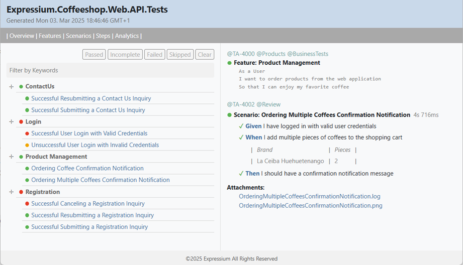

# Expressium LivingDoc

The Expressium LivingDoc is generating a self-contained HTML test report
in a Living Documentation style for your ReqnRoll projects.

The report generation is based on the Cucumber Messages format produced by ReqnRoll
during the execution of Behavior-Driven Development (BDD) tests.

<br />


## How-To-Use
* Add the Expressium LivingDoc nuget packages to your ReqnRoll test project...
* Configure the ReqnRoll to generate the Cucumber Messages JSON file...
* Execute the ReqnRoll Behavior-Driven Development tests in the solution...
* Execute the Expressium.LivingDoc.exe file with arguments from the output folder...

## Command Line Arguments
```
Expressium.LivingDoc.exe .\Samples\stack-traces.feature.ndjson ".\Compatibility Kit Stack Traces.html"
```

## Demo Expressium LivingDoc Test Report
Web: https://expressium.dev/reqnroll/LivingDoc.html