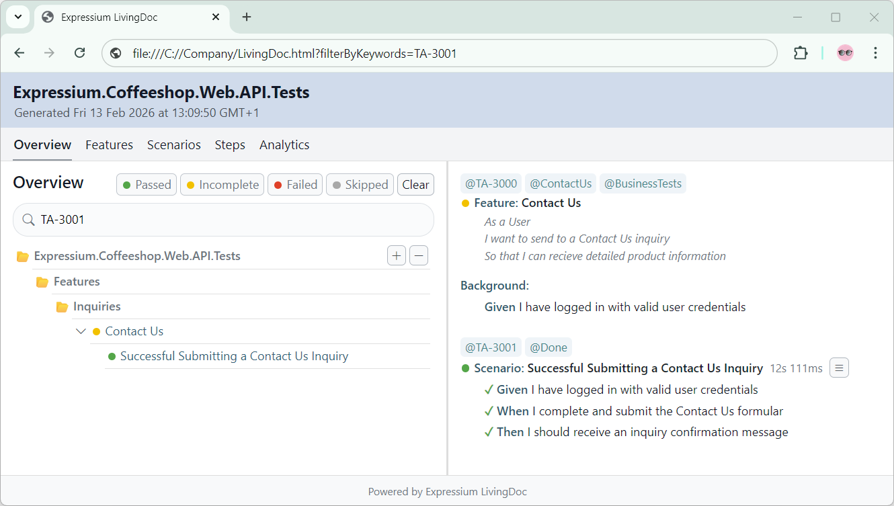
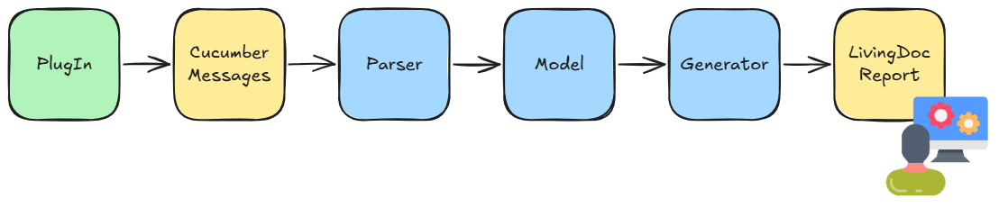

# Expressium LivingDoc

## Introduction

Expressium LivingDoc is an open-source tool that generates a single
HTML test report in a Living Documentation style for ReqnRoll projects.

The report is built upon the Cucumber Messages format produced by ReqnRoll
during the execution of Behavior-Driven Development (BDD) tests.

The final HTML test report may along with linked attachments
be distributed to a public location enabling easy access by the stackholders.

<br />
<p align="center">

</p>

**Example:** [https://expressium.dev/reqnroll/LivingDoc.html](https://expressium.dev/reqnroll/LivingDoc.html)

## Getting Started
* Add the Expressium.LivingDoc.ReqnrollPlugin NuGet package to the ReqnRoll test project...
* Setup the Expressium formatters properties in the configuration of ReqnRoll test project...
* Run the tests in the ReqnRoll test project and open the HTML report in the output directory...

```json
{
  "$schema": "https://schemas.reqnroll.net/reqnroll-config-latest.json",
  "formatters": {
    "expressium": {
      "outputFilePath": "LivingDoc.ndjson",
      "outputFileTitle": "Expressium.Coffeeshop.Web.API.Tests"
    }
  }
}
```

## Attachments
Since the AddAttachment API in ReqnRoll doesn’t support adding attachments as links,
we need to use a workaround to enable attachments in the Expressium LivingDoc report.

```c#
using Reqnroll;

namespace MyCompany.MyProject.Web.API.Tests
{
    internal static class ReqnRollExtensions
    {
        internal static void AddAttachmentAsLink(this IReqnrollOutputHelper outputHelper, string path)
        {
            outputHelper.WriteLine($"[Attachment: {path}]");
        }
    }
}
```

## Merging Reports
The ReqnRoll test execution may run across multiple pipelines
and it is desirable to produce a single consolidated test report.
A merging of test reports can be achieved through a separate CLI program.
Only new and previously unknown features will be included during the merge process.

```c#
if (args.Length == 5 && args[0] == "--merge")
{
    // Generating a LivingDoc Test Report based on Two Cucumber Messages JSON files...
    Console.WriteLine("");
    Console.WriteLine("Generating LivingDoc Test Report...");
    Console.WriteLine("InputMaster: " + args[1]);
    Console.WriteLine("InputSlave: " + args[2]);
    Console.WriteLine("Output: " + args[3]);
    Console.WriteLine("Title: " + args[4]);

    var livingDocConverter = new LivingDocConverter();
    livingDocConverter.Generate(new List<string>() { args[1], args[2] }, args[3], args[4]);

    Console.WriteLine("Generating LivingDoc Report Completed");
    Console.WriteLine("");
}
```

## Command Line Interface
For many different purposes, it may be desirable to customize the final Expressium LivingDoc test report.
You can achieve this by creating a separate custom CLI project, adding a project reference to the ReqnRoll test project
and implementing any logic needed to handle your specific reporting requirements.

```c#
if (args.Length == 7 && args[0] == "--custom")
{
    // Generating a custom LivingDoc Test Report based on a Cucumber Messages JSON file...
    Console.WriteLine("");
    Console.WriteLine("Generating LivingDoc Test Report...");
    Console.WriteLine("Input: " + args[2]);
    Console.WriteLine("Output: " + args[4]);
    Console.WriteLine("Title: " + args[6]);

    var livingDocConverter = new LivingDocConverter();
    var livingDocProject = livingDocConverter.Convert(args[2], args[6]);

    // Omitting overview folders...
    foreach (var feature in livingDocProject.Features)
        feature.Uri = null;

    livingDocConverter.Generate(livingDocProject, args[4]);

    Console.WriteLine("Generating LivingDoc Report Completed");
    Console.WriteLine("");
}
```

## Deep Linking
When the Expressium LivingDoc report is opened in a browser,
the onload event automatically reads URL query parameters and applies filters accordingly.
This enables direct linking to specific scenarios or features filtered by keywords within the LivingDoc report.

```bat
start chrome "file:///C://Company/Coffeeshop.html?filterByKeywords=TA-3001"
```

<br />
<p align="center">

</p>

## The LivingDoc Process
<br />
<p align="center">

</p>

The Expressium LivingDoc process uses the Reqnroll PlugIn to capture test execution results and output them as Cucumber Messages (NDJSON).
These messages are parsed into an object-oriented model, which the Generator transforms into a self-contained HTML LivingDoc test report.
