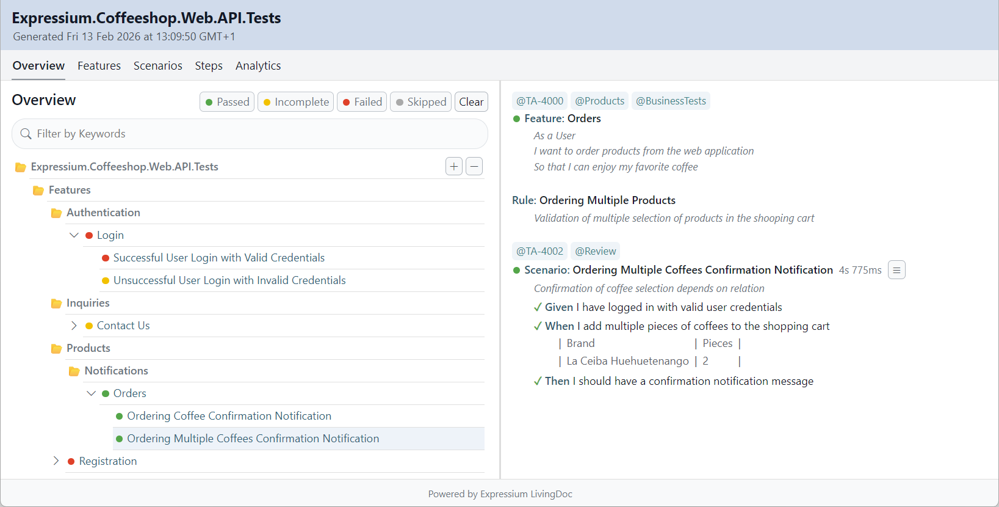

# Expressium LivingDoc

Expressium LivingDoc is an open-source tool that generates a single
HTML test report in a Living Documentation style for ReqnRoll projects.

The report is built upon the Cucumber Messages format produced by ReqnRoll
during the execution of Behavior-Driven Development (BDD) tests.

The final HTML test report may along with linked attachments
be distributed to a public location enabling easy access by the stackholders.

<br />


## How-To-Use
* Add the Expressium.LivingDoc.ReqnrollPlugin NuGet package to the ReqnRoll test project...
* Setup the Expressium formatters properties in the configuration of ReqnRoll test project...
* Run the tests in the ReqnRoll test project and open the HTML report in the output directory...

### ReqnRoll Configuration
```json
{
  "$schema": "https://schemas.reqnroll.net/reqnroll-config-latest.json",
  "formatters": {
    "expressium": {
      "outputFilePath": "LivingDoc.ndjson",
      "outputFileTitle": "Expressium.Coffeeshop.Web.API.Tests"
    }
  }
}
```

### Attachments Work-Around
Since the AddAttachment API in ReqnRoll doesn’t support adding attachments as links,
we need to use a workaround to enable attachments in the Expressium LivingDoc report.

```c#
using Reqnroll;

namespace MyCompany.MyProject.Web.API.Tests
{
    internal static class ReqnRollExtensions
    {
        internal static void AddAttachmentAsLink(this IReqnrollOutputHelper outputHelper, string path)
        {
            outputHelper.WriteLine($"[Attachment: {path}]");
        }
    }
}
```

### Merge Test Reports
The ReqnRoll test execution may run across multiple pipelines
and it is desirable to produce a single consolidated test report.
A merging of test reports can be achieved through a separate CLI program.
Only new and previously unknown features will be included during the merge process.

```c#
if (args.Length == 5 && args[0] == "--merge")
{
    // Generating a LivingDoc Test Report based on Two Cucumber Messages JSON files...
    Console.WriteLine("");
    Console.WriteLine("Generating LivingDoc Test Report...");
    Console.WriteLine("InputMaster: " + args[1]);
    Console.WriteLine("InputSlave: " + args[2]);
    Console.WriteLine("Output: " + args[3]);

    var messagesParser = new MessagesParser();
    var livingDocProjectMaster = messagesParser.ConvertToLivingDoc(args[1]);
    var livingDocProjectSlave = messagesParser.ConvertToLivingDoc(args[2]);

    livingDocProjectMaster.Title = args[4];
    livingDocProjectMaster.Merge(livingDocProjectSlave);

    var livingDocProjectGenerator = new LivingDocProjectGenerator(livingDocProjectMaster);
    livingDocProjectGenerator.Generate(args[3]);

    Console.WriteLine("Generating LivingDoc Report Completed");
    Console.WriteLine("");
}
```

## Expressium LivingDoc Demo Test Report
**Web:** https://expressium.dev/reqnroll/LivingDoc.html
